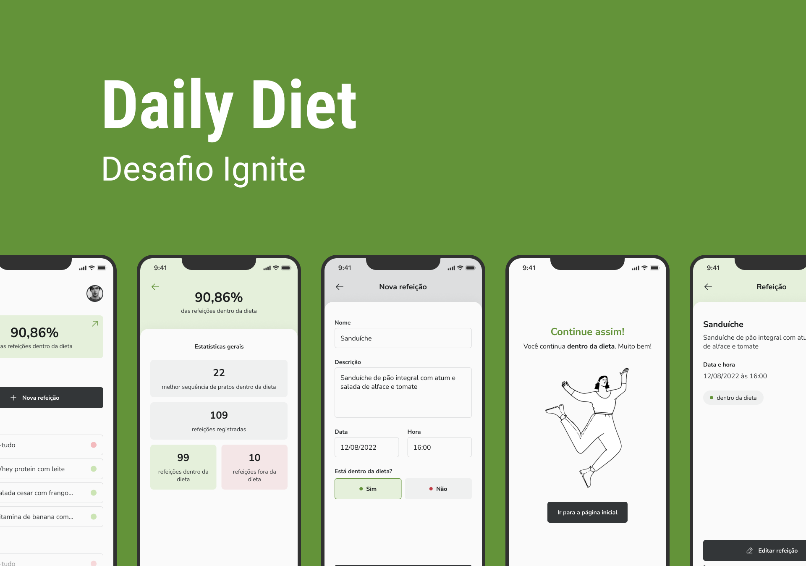

# Daily Diet App (Mobile)

## :computer: Sobre

Aplicação que permite ao usuário registrar as refeições realizadas, sejam elas dentro da dieta ou não.

## 🛠 Funcionalidades

Requested in this Challenge:

- :white_check_mark: Adicionar Refeição
- :white_check_mark: Editar Refeição
- :white_check_mark: Remover refeição da lista
- :white_check_mark: Mostrar estatísticas
- :white_check_mark: Navegar entre telas
- :white_check_mark: Armazenamento local dos dados

## 🛠 Tech Stack

Este projeto foi desenvolvido utilizando:

- [React Native][reactnative]
- [Expo][expo]
- [TypeScript][typescript]

## Demonstração

